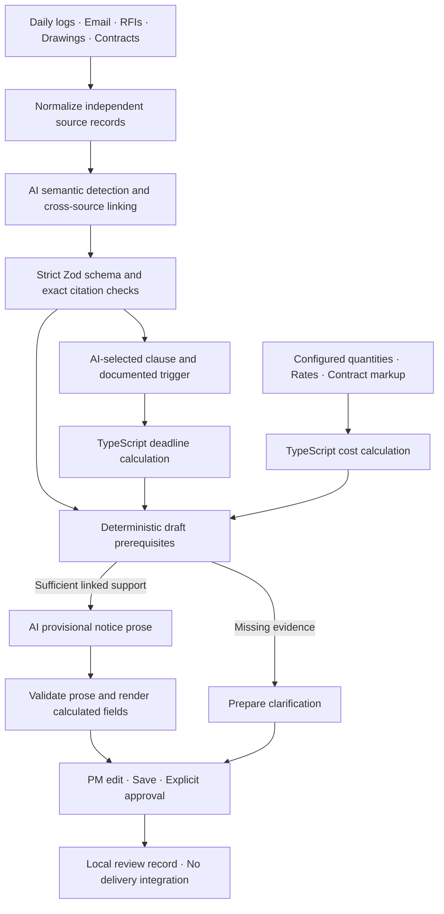

# Evidence to PM action

Trailmark sits above the systems that already produce construction records. Daily logs remain daily logs; email, RFIs, drawings and contracts remain the record of work and direction. A normalization layer preserves source identity, timestamps, field paths and verbatim text. Trailmark connects those records into a reviewable event rather than replacing their authoring systems.

## Why interpretation uses AI

Semantic change detection needs to distinguish ordinary progress from scope movement expressed differently across records. Cross-source linking connects Rev C geometry, the utility direction, the RFI conflict and the log's additional work. Clause retrieval selects §12.4 among unrelated contract provisions. Notice drafting turns supported facts into readable provisional prose while retaining open questions.

The provider interface accepts a prompt and JSON Schema and returns an untrusted response plus execution metadata. It is independent of the local Codex adapter. Zod rejects unrecognized fields, including model-proposed costs, deadlines and send permissions. Source IDs, project ownership, source type, exact field paths and continuous verbatim excerpts must resolve. The clause ID must match the quoted contract field, and a trigger must use a linked record's allowed timestamp field.

These checks establish structural validity and provenance, not the truth of an interpretation. A correct quote can still be misinterpreted. The PM sees both the quote and the model's explanation, plus missing evidence; no confidence score overrides review.

## Why software owns the consequences

**Dates:** a pure function adds the configured elapsed-hour period to an explicit-offset timestamp, then formats in the project's IANA timezone. Tests cover daylight-saving transitions, leap dates, weekends and invalid inputs. The model selects a candidate trigger, but cannot supply the calculated deadline. An earlier direction may control; the current email-based result stays provisional and visible.

**Costs:** only the configured rate and quantity worksheet enters the calculator. Integer cents, thousandth-unit quantities, BigInt arithmetic and half-up rounding avoid floating-point money errors. Markup must agree with the structured contract term, and measured quantities must agree with their source fields. PM forecast allowances remain identified as forecasts. Detection never receives pricing. The notice model sees already calculated context, while software inserts monetary and deadline fields into the letter.

| Cost group           | Calculation                                           |      Amount |
| -------------------- | ----------------------------------------------------- | ----------: |
| Additional trenching | 70 ft × $85                                           |      $5,950 |
| Conduit / material   | 70 ft × $50 + 1 fittings package × $1,100             |      $4,600 |
| Crew labor           | 34 electrician hours × $110 + 14 operator hours × $85 |      $4,930 |
| Equipment            | 6 excavator hours × $140 + $60 pass-through fee       |        $900 |
| Markup, §12.6        | 12.5% × $16,320 eligible direct cost                  |      $2,040 |
| Preliminary total    | $16,380 + $2,040                                      | **$18,420** |

**Permissions and contractual action:** deterministic prerequisites require a potential change, corroborating sources, direction and additional-work support, supported event type, a contract/trigger, deadline and cost. Low confidence blocks drafting. Medium confidence with these prerequisites permits a provisional draft; unresolved questions require explicit acknowledgment before approval. The PM also confirms documents and recipient. `authorizeApproval` checks role, prerequisites, dismissal, acknowledgment and content. There is no delivery adapter, so the resulting state is `approved` with `delivery: not_connected`. Approval leaves the notice deadline open. This browser-local role is not security-grade authorization; authentication and delivery are outside this phase.

## Real results and uncertainty

Strawberry Fields' actual first result is medium confidence, not a definitive claim. It cites six excerpts across four field sources and retrieves §12.4 separately. Missing original scope, verified authority, earlier awareness and final cost/schedule substantiation are shown directly. The original strict gate conflated provisional drafting with final approval; separating those actions preserves the requested PM review without erasing uncertainty.

Clover Court's single log supports an ambiguous reroute, with low confidence and no relevant contract. No corroborating direction, pricing calculation or notice draft is manufactured. The UI requests superintendent clarification. Its raw allowance remains unverified.

The first notice response included a valid contract citation, which exposed a validator bug: field evidence and retrieved contract evidence were held separately, but only the first was allowed in notices. The validator now includes the retrieved contract. The original failure, original response bytes and separate offline revalidation remain inspectable. This was a system correction, not another model attempt.

## Recording and hosted replay

The recording scripts run an authenticated local Codex CLI in an isolated temporary directory, with no tools, web, apps or repository reads available to the analysis task. They use JSON Schema output, a timeout and an exclusive attempt file. They save only the final response and execution metadata, not authentication or reasoning streams. See the official [Codex non-interactive execution documentation](https://learn.chatgpt.com/docs/non-interactive-mode).

Artifacts preserve provider/model, source IDs, normalized-input hashes, request/schema hashes, response bytes, token usage, latency, tool-call count, validation and errors. Hashes detect accidental drift; they are not an external attestation. `verify:recordings` checks those artifacts against the actual sources and calculated notice context before every production build. The hosted app imports only preserved JSON and portable TypeScript; recording scripts and CLI execution are outside its import graph.

All inputs are fictional. The pipeline does not perform OCR, CAD parsing, source-system ingestion, authenticated approval or delivery. The other three project examples remain Phase 1 fixtures. The ten additional synthetic cases now have preserved single-attempt provider results and deterministic component metrics. See [Phase 3 evaluation](evaluation.md). A separate reliability gate controls PM surfacing before notice prerequisites; expected labels never enter that gate.
